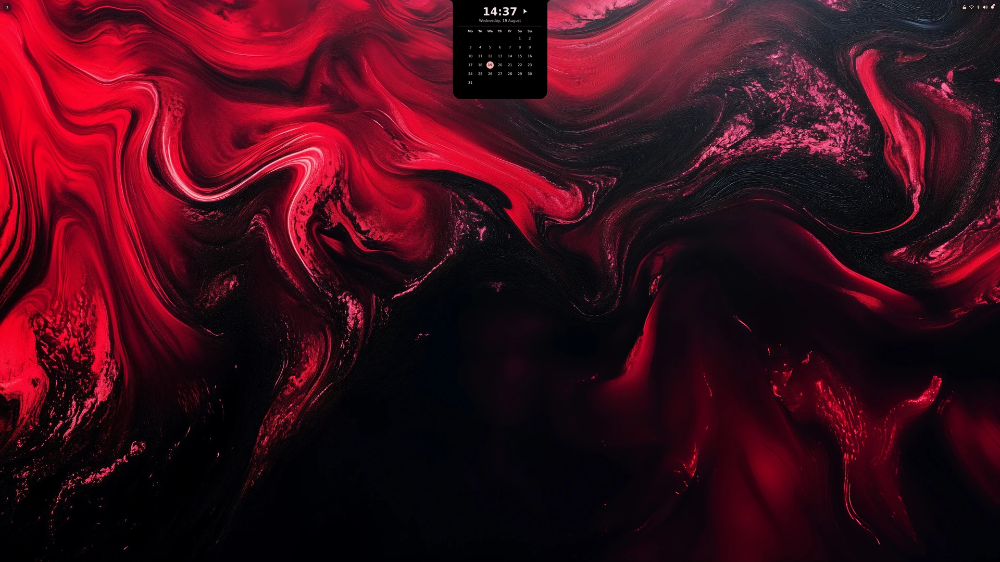
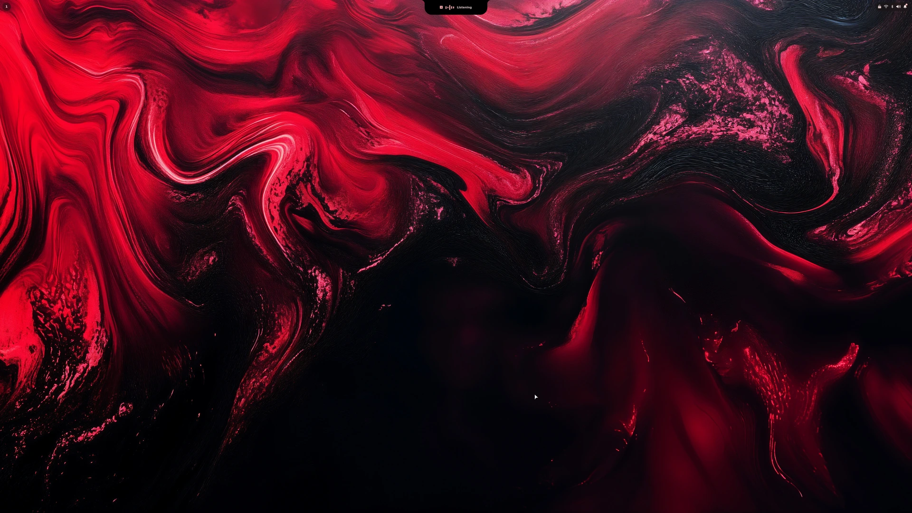
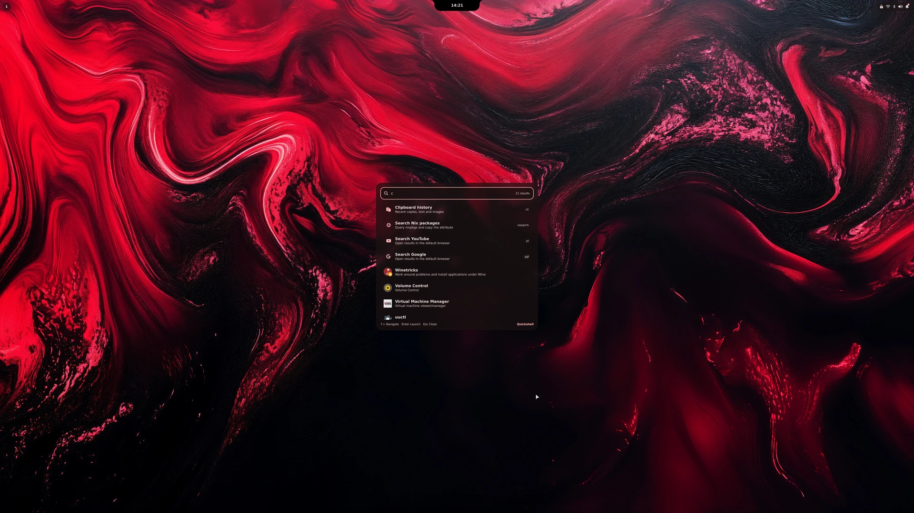
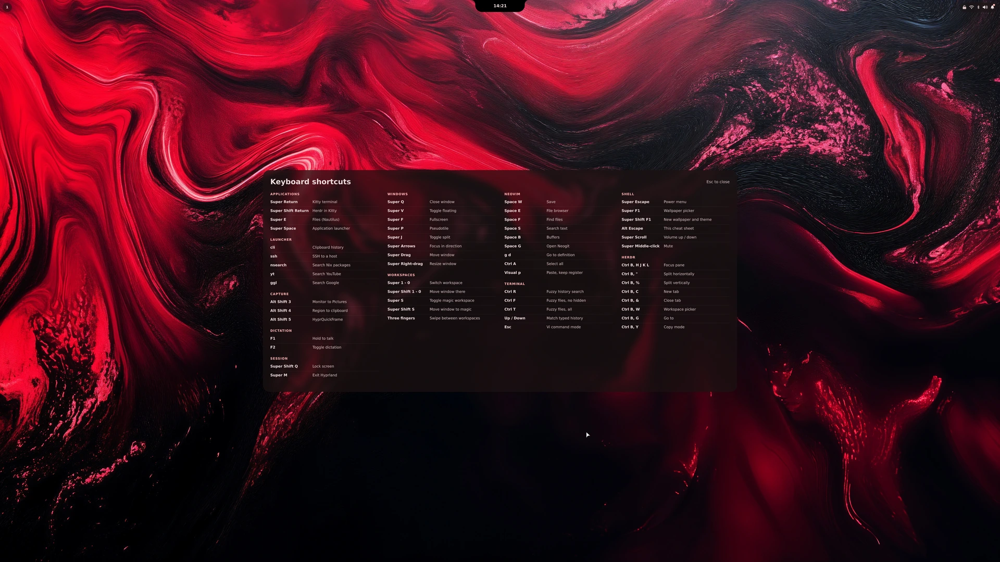
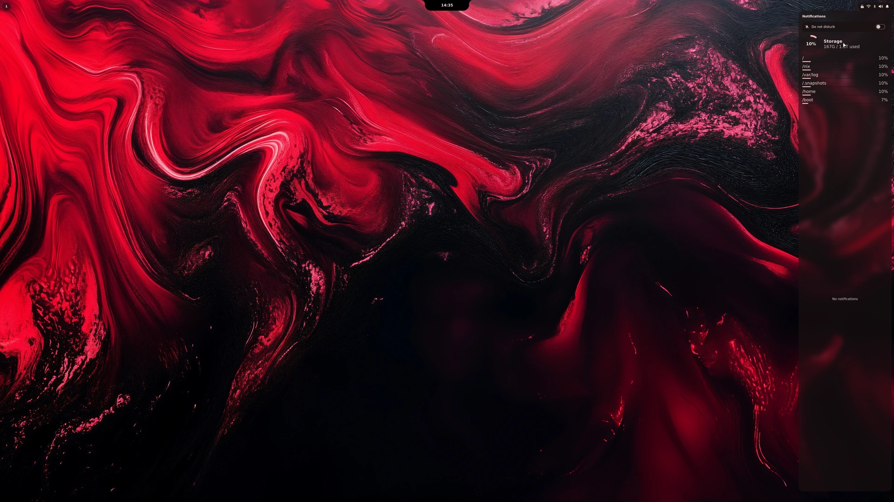
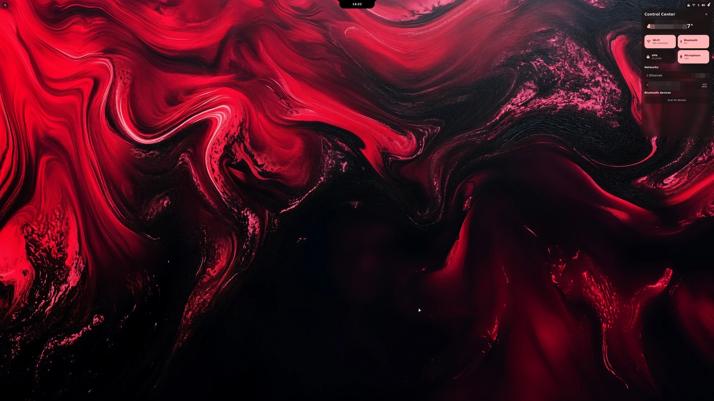
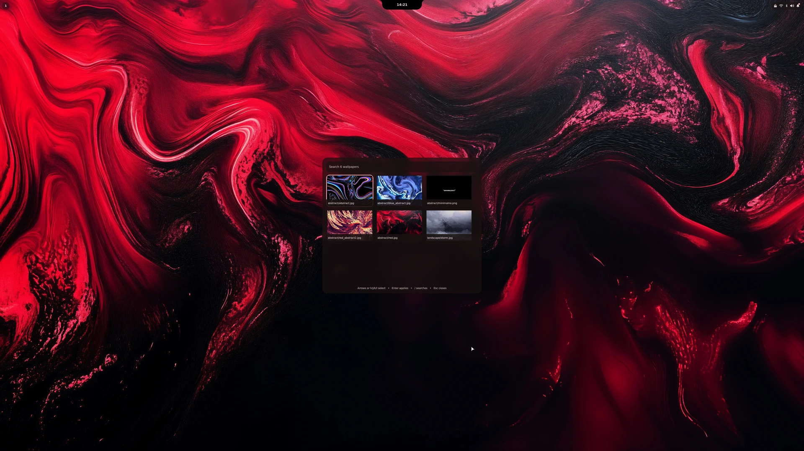
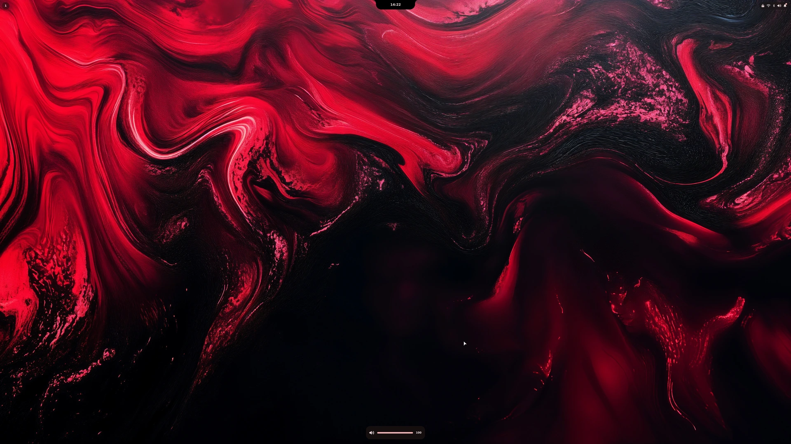

# nixos

My NixOS installation, configured declaratively with [flakes](https://nixos.wiki/wiki/Flakes),
[disko](https://github.com/nix-community/disko), and
[home-manager](https://github.com/nix-community/home-manager).

Installing from scratch is covered in the
**[installation guide](docs/installation.md)**, which also documents rebuilding
and upgrading afterwards. This page documents what the system actually does.


## Machine

| | |
|---|---|
| Host | `nixos` |
| User | `stivce` |
| CPU | AMD (Ryzen, with iGPU) |
| GPU | NVIDIA RTX 4070 Ti - **open** kernel module (hybrid: iGPU + dGPU, display on NVIDIA) |
| Firmware | UEFI (systemd-boot) |
| Filesystem | btrfs (subvolumes `@`, `@home`, `@nix`, `@log`, `@snapshots`), unencrypted |
| Display | Hyprland (Wayland) + SDDM, monitor at 3840×2160 @ 240 Hz |

## The shell

Hyprland runs through **UWSM**. There is no panel or status bar in the usual
sense: **Quickshell** draws three separate layer-shell surfaces along the top
edge - a workspaces pill on the left, the notch in the centre, and a status pill
on the right - and every other surface below is summoned over them. Supporting
services are **hyprlock**/**hypridle**, **hyprpolkitagent**, and **awww**, all
tied to the graphical session by Home Manager.

Everything below lives in [`config/quickshell/`](config/quickshell/) and is
deployed to `~/.config/quickshell/` by
[`home/quickshell.nix`](home/quickshell.nix).

### Notch

A macOS-style pill hanging from the top edge, showing the clock. The silhouette
is drawn as a path rather than a rounded rectangle, because the corners where it
meets the screen edge curve *away* from the body, which no border radius can
express.

Hovering springs it open into the month calendar:



It reserves only its collapsed height as an exclusive zone, so the expansion
floats over windows instead of pushing them down.

### Voice dictation

**hyprwhspr-rs** runs as a user service and types transcribed speech into the
focused window. `F1` is hold-to-talk and `F2` toggles for longer dictation; both
are bare function keys, so applications no longer receive `F1` or `F2`.

While it is live the notch takes over: the pill grows a little and swaps the
clock for a mic glyph, an animated waveform, and a label.




The daemon publishes each transition to `~/.cache/hyprwhspr-rs/status.json`,
which `Dictation.qml` watches, so the indicator follows what the daemon is
actually doing rather than what the keybinding asked for. The bars are
decorative: Quickshell's PipeWire service exposes no peak level to plot.

The notch normally sits on the `Top` layer, which Hyprland draws *below* a
fullscreen window - correct for a clock, wrong for push-to-talk feedback, since
the moment it matters is the moment there is no other way to tell whether the
mic is live. So it is promoted to `Overlay` for exactly as long as dictation is
running, and drops back afterwards.

Transcription goes to Groq's hosted Whisper, so audio leaves the machine; set
`transcription.provider` in
[`config/hyprwhspr-rs/config.jsonc`](config/hyprwhspr-rs/config.jsonc) to
`parakeet` or `whisper_cpp` to keep it local instead.

The API key is the one piece that is not declarative, because it must not be
committed. Create it once, readable only by the account:

```sh
install -m600 /dev/null ~/.config/hyprwhspr-rs/env
printf 'GROQ_API_KEY=%s\n' "<key>" > ~/.config/hyprwhspr-rs/env
systemctl --user start hyprwhspr-rs
```

The daemon resolves the Groq backend at startup and exits if the key is missing,
so the unit is gated on that file existing. Until it does, `systemctl --user
status hyprwhspr-rs` reports the unit as skipped by a condition check rather
than failing repeatedly.

### App launcher

`SUPER+SPACE`. Fuzzy search over desktop entries, with the command vocabulary
mixed into the same result list.


Typing narrows to applications:


Commands appear alongside them, so there is no separate mode to remember:



| Keyword | Does |
|---|---|
| `cli` | Clipboard history - recent copies, text and images |
| `ssh` | Connect to a host in a terminal session |
| `nsearch` | Query nixpkgs and copy the attribute |
| `yt` | Search YouTube in the default browser |
| `ggl` | Search Google in the default browser |

Pressing Enter on a command enters its mode. `nsearch` queries nixpkgs live:


The table lives in [`LauncherCommands.qml`](config/quickshell/LauncherCommands.qml)
so that adding a command makes it appear in both the launcher and the cheat
sheet without either being told about it.

### Keyboard cheat sheet

`ALT+ESCAPE`. Generated from the same command table as the launcher, so it
cannot drift out of date on that half; the keybinding half is kept in step with
[`config/hypr/hyprland.lua`](config/hypr/hyprland.lua) by hand.



### Notifications

Quickshell is the notification daemon. Popups stack in the top-right corner:


Clicking the status pill opens the centre, which keeps the history along with a
do-not-disturb toggle and a per-filesystem storage breakdown:



### Control centre

The other half of the status pill: weather, the Wi-Fi, Bluetooth, VPN and
microphone toggles, the active networks, and Bluetooth device discovery.



The location line, Wi-Fi SSID and LAN address are pixelated in that screenshot
on purpose - this repository is public, and those three fields identify where
the machine physically is. Weather lookup sends the configured location to
Open-Meteo's geocoding API, then sends its coordinates to the forecast API every
15 minutes. Open-Meteo states that its public API does not collect personal data
or use third-party tracking.

### Power menu

`SUPER+ESCAPE`. Lock, suspend, log out, reboot, shut down. Destructive entries
ask for confirmation before acting.


### Wallpaper picker and theming

`SUPER+F1` opens the native Quickshell picker over everything in
`~/Pictures/wallpapers`.



Picking an image applies it through Awww and runs Matugen to regenerate a
Material dark palette for Hyprlock, Kitty, Quickshell, and Hyprland's accent
colors. Kitty instances are updated live through their remote-control sockets;
Quickshell watches its palette file, and Hyprland is reloaded after generation.
Every screenshot on this page is tinted by whichever wallpaper was set at the
time - the shell has no colours of its own.

The generated files are writable runtime state. Home Manager seeds them once
from `config/matugen/defaults/`, then leaves them under Matugen's ownership, so
a rebuild does not reset the selected theme. See
[`config/matugen/README.md`](config/matugen/README.md) for the complete template
and ownership lifecycle.

Wallpapers are pinned by the flake and exposed at `~/Pictures/wallpapers`. The
SDDM login screen uses the same default image through **SilentSDDM** with the
`catppuccin-mocha` theme. Reset to the default with `~/Scripts/set-wallpaper.sh`
or `SUPER+SHIFT+F1`.

### Volume

Bound to the media keys and to `SUPER`+scroll, with a transient OSD along the
bottom edge.



### Other bindings

Screenshots are `ALT+SHIFT+3` for the focused output, `ALT+SHIFT+4` for an
interactive region, and `ALT+SHIFT+5` for **HyprQuickFrame**. `SUPER+M` exits
through **hyprshutdown** and `SUPER+SHIFT+Q` locks the session.

Clipboard history is limited to 200 entries in the private per-login runtime
directory and is erased at logout, so copied secrets are not retained on disk
across sessions.

## Inputs

| Input | Purpose |
|---|---|
| `nixpkgs` | `nixos-26.05` (stable) |
| `nixpkgs-unstable` | Selected user applications not available on stable |
| `disko` | Declarative disk partitioning |
| `home-manager` | `release-26.05` - per-user `$HOME` state |
| `wallpapers` | [`st1vc3/wallpaper`](https://github.com/st1vc3/wallpaper), pinned (not a flake) |
| `silentSDDM` | [`uiriansan/SilentSDDM`](https://github.com/uiriansan/SilentSDDM) - SDDM theme |
| `hyprquickframe` | [`Ronin-CK/HyprQuickFrame`](https://github.com/Ronin-CK/HyprQuickFrame) - region screenshot UI |
| `zen-browser` / `helium` | Community flakes packaging the two browsers |
| `stable-diffusion-webui` | [`Janrupf/stable-diffusion-webui-nix`](https://github.com/Janrupf/stable-diffusion-webui-nix) - Forge web UI; keeps its own nixpkgs, see the comment in `flake.nix` |

## Layout

| Path | Purpose |
|---|---|
| `flake.nix` / `flake.lock` | Inputs and the `nixos` system definition (pinned) |
| `configuration.nix` | Thin entry point: boot, network, locale, users + `imports` |
| `hardware-configuration.nix` | Machine-specific, generated during install |
| `disko.nix` | Declarative disk layout - **set the target `device` before use** |
| `modules/nvidia.nix` | NVIDIA graphics, kernel driver, and video environment |
| `modules/desktop.nix` | Hyprland, SDDM + SilentSDDM theme, portals, lock, fonts |
| `modules/audio.nix` | PipeWire |
| `modules/dictation.nix` | hyprwhspr-rs voice dictation daemon and its Groq credential |
| `modules/apps.nix` | Small set of system-wide CLI/recovery tools |
| `modules/gaming.nix` | Steam, GameMode, and libvirt system services |
| `modules/printing.nix` | CUPS, printer discovery, and the printer configuration UI |
| `modules/snapshots.nix` | Snapper schedule and bounded root-snapshot retention |
| `home/stable-diffusion.nix` | On-demand Stable Diffusion Forge desktop application; launches Forge and opens localhost:7860 |
| `home/default.nix` | home-manager wiring |
| `home/stivce.nix` | User identity and shared configuration-file deployment |
| `home/packages.nix`, `home/services.nix`, `home/theming.nix`, `home/neovim.nix`, `home/git.nix`, `home/gaming.nix` | Focused user packages, services, toolkit theme, editor, Git, and game launcher modules |
| `home/quickshell.nix` | Quickshell option, config deployment, palette seed, and user service |
| `config/hypr/`, `config/quickshell/`, `config/kitty/`, `config/nvim/`, `config/herdr/`, `config/zsh/`, `config/hyprquickframe/`, `config/hyprwhspr-rs/` | Configs deployed to `~/.config/` |
| `config/matugen/` | Theme templates, startup defaults, and ownership documentation |
| `config/agents/shared.md` | Shared global instructions deployed to Claude Code and Codex |
| `pkgs/` | Locally maintained packages not available from nixpkgs |
| `scripts/set-wallpaper.sh` | Wallpaper setter (awww) + matugen retheme → `~/Scripts/` |
| `scripts/start-optcg.sh`, `scripts/misc/` | One Piece TCG launcher and screenshot helpers → `~/.local/bin/` |
| `docs/installation.md` | Install from the live ISO, then rebuilding and upgrading |
| `docs/images/` | Screenshots used on this page |
| `docs/snapshots.md` | Snapshot scope, existing-system migration, and routine commands |
| `docs/rollback.md` | Safe rebuild workflow and system/file recovery procedures |
| `docs/review/` | Review checklist and implementation history |

## Formatting and linting

`nix fmt` (wired to `nixfmt`, the RFC 166 formatter) enforces consistent
style. Check tracked Nix files before committing so unrelated paths such as a
local `result` symlink are not traversed:

```bash
nix fmt -- --check $(git ls-files '*.nix')
```

`nix flake check` validates that the flake still evaluates. For deeper
style/dead-code checks, run `statix check .` and `deadnix .`
(`nix run nixpkgs#statix -- check .` / `nix run nixpkgs#deadnix -- .` if not
installed).

## Notes

- **NVIDIA hybrid gotcha:** do **not** set `GBM_BACKEND` or `AQ_DRM_DEVICES` in
  the environment - they crash Hyprland's aquamarine backend on this box. With
  `hardware.nvidia.open = true` + modesetting, the NVIDIA card is auto-selected.
- **Fresh accounts start locked.** The installation guide sets the `stivce`
  password interactively before reboot, so no credential is stored in Git.
  SSH password and root logins are disabled; add an authorized key before
  expecting remote access.
- **Quickshell does not reload on rebuild.** `nixos-rebuild switch` replaces the
  symlinks in `~/.config/quickshell/`, but the running service keeps the old QML
  until `systemctl --user restart quickshell`. Applications launched by the
  shell run in independent UWSM scopes, so restarting it does not close them.
